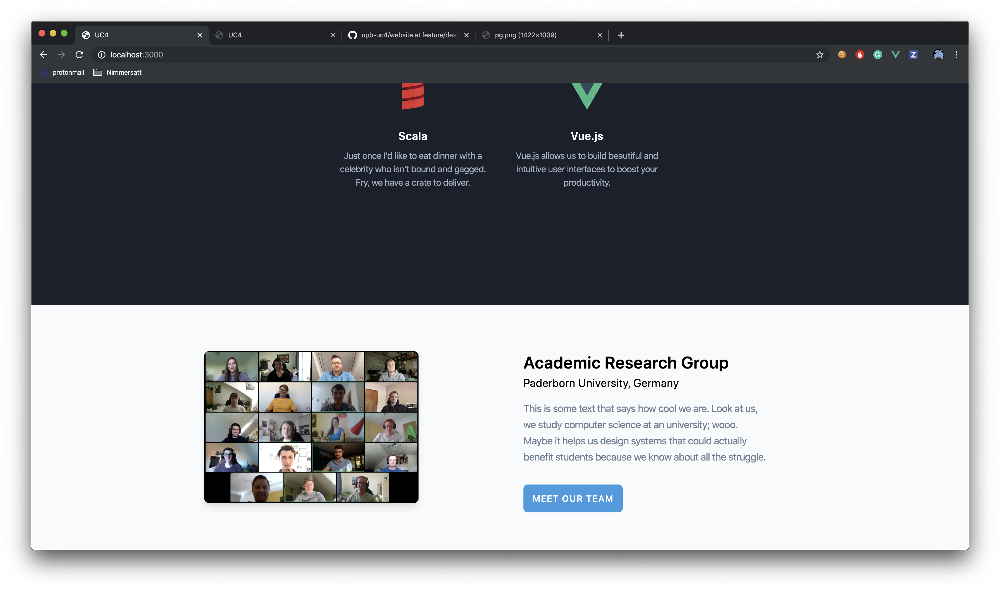
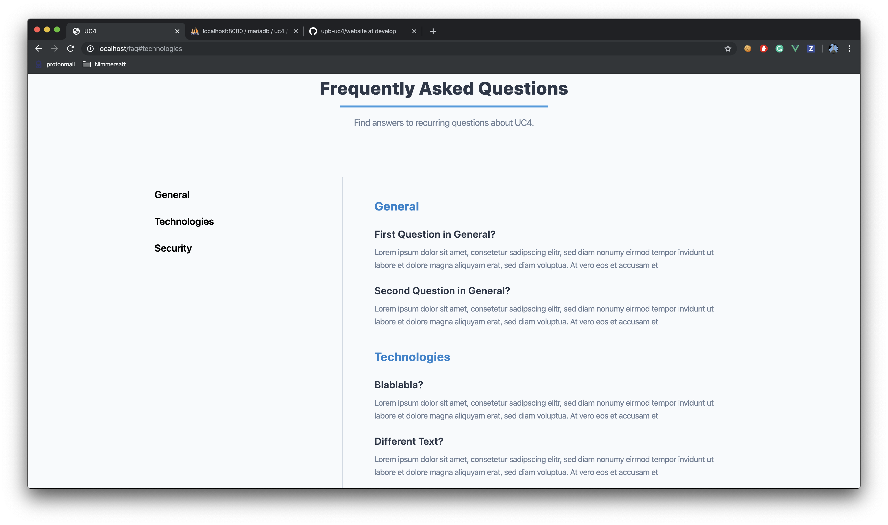

## Screenshots

### Landing Page Draft 1/5


### Landing Page Draft 2/5


### Landing Page Draft 3/5


### Landing Page Draft 4/5


### Landing Page Draft 5/5


### About Page Draft


### F.A.Q Page Draft



## Run this project locally with Docker

1. ```git clone https://github.com/Laradock/laradock.git```
2. ```cp env-example .env```
3. Modify the following lines in the generated ```.env``` file:
    
    ```APP_CODE_PATH_HOST=../PATH_TO_THIS_PROJECT```

    ```PMA_DB_ENGINE=mariadb```
    
    ```APACHE_DOCUMENT_ROOT=/var/www/public```.

Note: The ```.env``` has to be adapted to the current OS. Hence, certain flags or options may have to be changed. Search for your running OS (eg. "windows") in the file and change the options according to the instructions.

4. Save the file
5. Spin up the docker containers; this may take a while:

    ```docker-compose up -d apache2 mariadb phpmyadmin```. 

6. Head to the website directory (this repo) 
7. Rename  ```.env.example```  to ```.env```
8. Modify the renamed ```.env```:

    ```DB_CONNECTION=mysql```, 
    
    ```DB_HOST=mariadb```, 
    
    ```DB_DATABASE=uc4```,
    
    ```DB_USERNAME=root```,
    
    ```DB_PASSWORD=root```
9. > As we don't need a database yet, you could skip step 9 and 10

    Open your browser and navigate to phpmyadmin on ```localhost:8080``` and

    login with ```server=mariadb```, ```username=root```, ```password=root```
   
10. Create a new database with the name ```uc4```.
11. Inside the laradock folder run ```docker-compose exec workspace bash```. This will connect you to the dockerized server
  
11.1. Run ```php artisan key:generate``` in order to generate an ```APP_KEY``` right into your ```.env``` file
   
11.2. Run ```npm run watch``` to generate all required css and js files

Note: You may have to install the composer packages (for ```php artisan key:generate```)  and the npm_modules (for ```npm run watch```) on the first try. If so, type ```composer-install``` or ```npm install``` accordingly.

12. Navigate to ```localhost``` or ```localhost:3000``` (for hot reloads) and see the website

If you got any problems with the setup process, feel free to contact Theo


