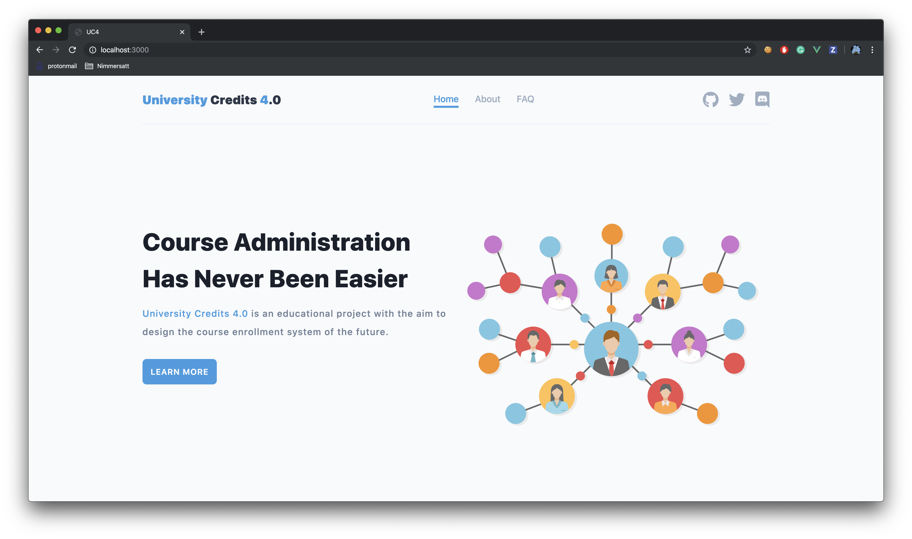
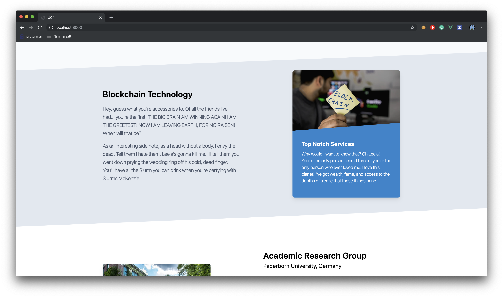
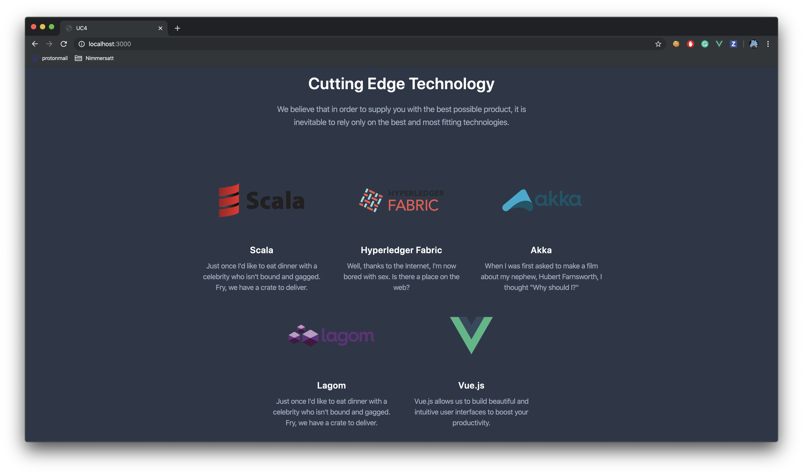
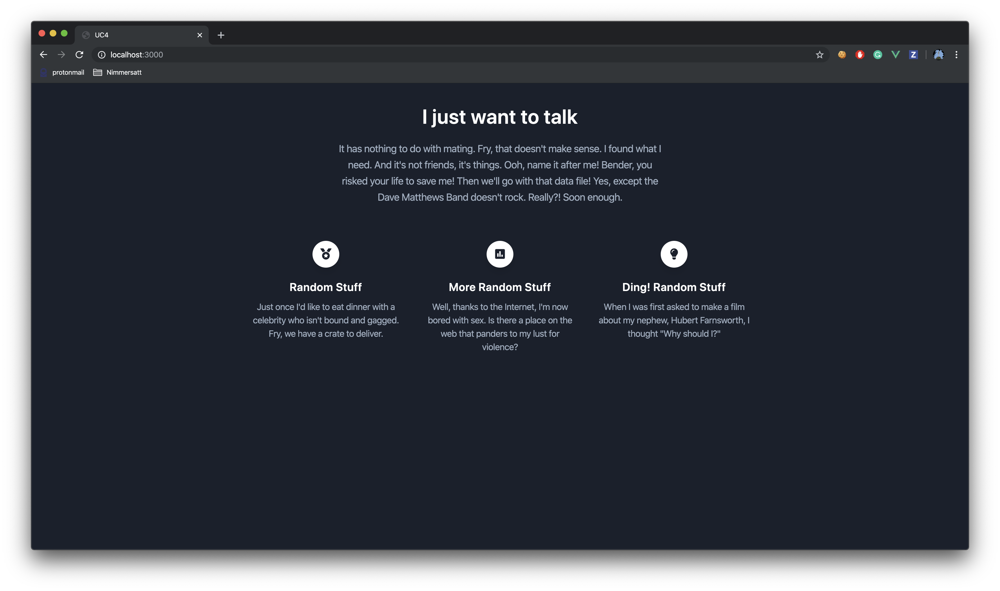
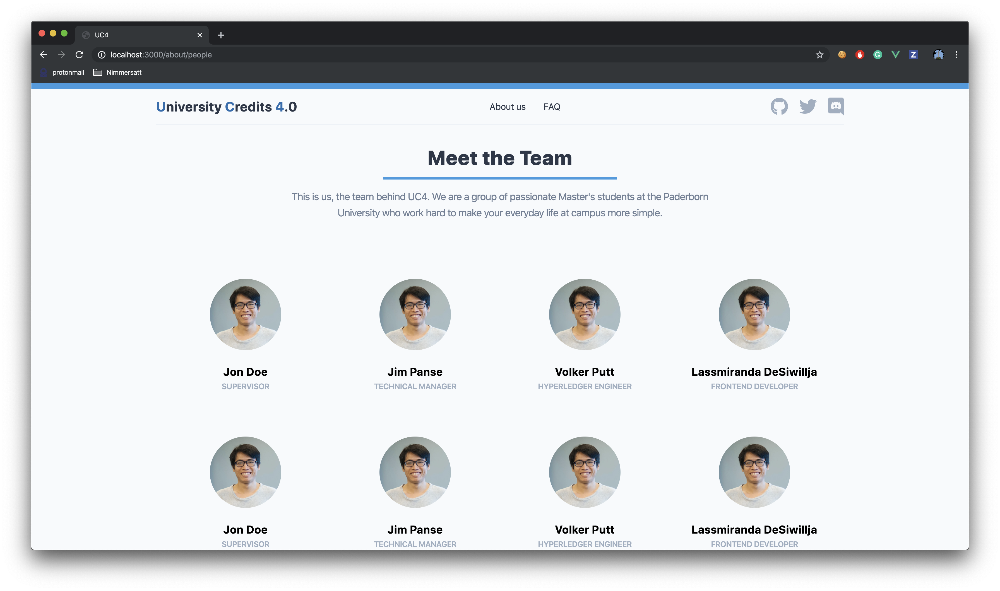

## Screenshots

### Landing Page Draft 1/4


### Landing Page Draft 2/4


### Landing Page Draft 3/4


### Landing Page Draft 4/4


### About Page Draft


## Run this project locally with Docker

1. ```git clone https://github.com/Laradock/laradock.git```
2. ```cp env-example .env```
3. Modify the following lines in the generated ```.env``` file:
    
    ```APP_CODE_PATH_HOST=../PATH_TO_THIS_PROJECT```

    ```PMA_DB_ENGINE=mariadb```
    
    ```APACHE_DOCUMENT_ROOT=/var/www/public```.

4. Save the file
5. Spin up the docker containers; this may take a while:

    ```docker-compose up -d apache2 mariadb phpmyadmin```. 

6. Head to the website directory (this repo) 
7. Rename  ```.env.example```  to ```.env```
8. Modify the renamed ```.env```:

    ```DB_CONNECTION=mysql```, 
    
    ```DB_HOST=mariadb```, 
    
    ```DB_DATABASE=uc4```,
    
    ```DB_USERNAME=root```,
    
    ```DB_PASSWORD=root```
9. > As we don't need a database yet, you could skip step 9 and 10

    Open your browser and navigate to phpmyadmin on ```localhost:8080``` and

    login with ```server=mariadb```, ```username=root```, ```password=root```
   
10. Create a new database with the name ```uc4```.
11. Inside this git repository run ```docker-compose exec workspace bash```. This will connect you to the dockerized server
  
12. Run ```php artisan key:generate``` in order to generate an ```APP_KEY``` right into your ```.env``` file
   
13. Run ```npm run watch``` to generate all required css and js files

14. Navigate to ```localhost``` or ```localhost:3000``` (for hot reloads) and see the website

If you got any problems with the setup process, feel free to contact Theo


